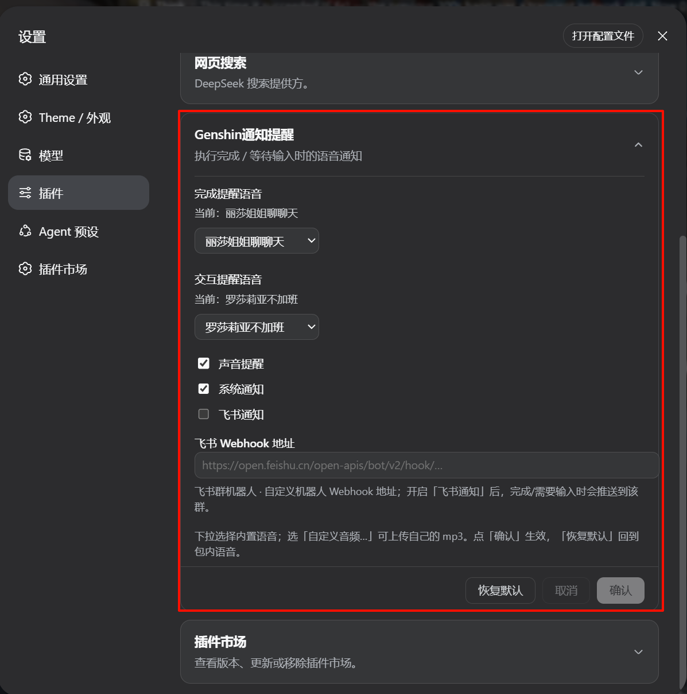

# dsh-genshin-lisa-notice

DeepSeek Harness 插件：**每次执行完成播放音频提醒**，内置多款原神角色语音；agent 向你提问、等待输入时也会提醒。  
A DeepSeek Harness plugin that **plays an audio alert when an execution completes — or when the agent asks for your input**, with a built-in library of Genshin Impact character voices.

## 关于名字 / About the name

插件名叫 `dsh-genshin-lisa-notice`（即 lisa-notice）。**最初只是想用原神·丽莎的语音做个单纯的"执行完成提醒"**，所以按角色名（Lisa）起了名。后来一个版本一个版本地迭代，功能越来越多：加了交互提醒、配置文件、下拉选择内置语音库、自定义音频上传……但**懒得改名字了**，就一直沿用至今。名字里的 `lisa` 更多是个"起源彩蛋"，并不代表现在只支持丽莎这一个语音。

The package is named `dsh-genshin-lisa-notice` (i.e. `lisa-notice`). It **started as a plain "execution-complete reminder" using Genshin Impact Lisa's voice**, named after that character. Over many releases the scope grew — interaction alerts, a settings page, a built-in voice library with a dropdown, custom audio upload — but the name stuck because **renaming it was never worth the churn**. The `lisa` in the name is now more of an origin easter egg than a statement that only Lisa's voice is supported.

## 功能 / Features

- 任意会话的执行完成（回合即将关闭）时，在浏览器中播放一次音频提醒，并**发送浏览器系统通知（含任务完成摘要）**
- agent 调用提问工具（`ask_user_question`）向你请求输入时，同样播放提醒并发送通知
- **声音 / 系统通知** 两种方式默认开启，可在 **设置 → 插件 → 配置** 里分别用**开关**关闭
- 两种提醒**可分别配置语音**：内置语音库（完成默认"丽莎姐姐聊聊天"、交互默认"罗莎莉亚不加班"，另有兹白·无须言语 / 罗莎莉亚·还不走吗 / 胡桃·晒太阳月亮歌）在 **设置 → 插件 → 配置** 里**下拉选择**，也可一键恢复默认
- 也支持**上传自定义音频**（显示原文件名），并可随时回退到内置语音
- 多次完成会合并为一次播放，避免刷屏
- 音频素材随包分发，无需外部路径依赖
- Plays an alert per completed execution (any session) and when the agent asks for your input, plus a browser system notification with the task summary. Sound and notification are both on by default and each can be toggled. Completion and interaction voices are selectable separately from a built-in library (defaults: "丽莎姐姐聊聊天" / "罗莎莉亚不加班") via a dropdown, plus custom upload; the audio assets ship inside the package.

## 安装 / Install

插件已发布在 [EagleClark/dsh-genshin-lisa-notice](https://github.com/EagleClark/dsh-genshin-lisa-notice)，通过 GitHub 安装：

```sh
dsh plugin --profile web add github:EagleClark/dsh-genshin-lisa-notice
```

（若已发布到 npm，也可 `dsh plugin --profile web add dsh-genshin-lisa-notice`。）

装完**重启 `dsh web`**，刷新页面生效（客户端 bundle 随启动图注入）。

## 使用方法 / Usage

**1. 触发提醒** —— 装好后无需任何操作，两种时刻会自动响语音：

- 🏁 **执行完成**：任意会话的回合结束时，播放"完成提醒语音"
- 💬 **等待输入**：agent 通过 `ask_user_question` 向你提问时，播放"交互提醒语音"

**2. 配置语音** —— 打开 **设置 → 插件 → 配置**，展开 **Genshin通知提醒** 卡片（默认折叠）：

- 完成/交互各一个**下拉框**，点开可选内置语音（显示友好名）
- 选「自定义音频…」可上传你自己的 mp3（之后显示原文件名）
- 点 **确认** 保存并立即生效；**取消** 丢弃未确认的选择；**恢复默认** 一键回到内置默认
- 配置即时生效，无需重启

**3. 听不到声音？** 浏览器自动播放策略要求页面有过一次用户交互（点击/按键）。重启后第一次提醒若被拦截，点一下页面任意处后下次提醒即可正常出声。

## 配置 / Configuration

打开 **设置 → 插件 → 配置**，展开 **Genshin通知提醒** 卡片：

- **完成提醒语音**（默认：丽莎姐姐聊聊天）/ **交互提醒语音**（默认：罗莎莉亚不加班）：各一个下拉框，内置语音为：
  - 丽莎姐姐聊聊天
  - 罗莎莉亚不加班
  - 兹白·无须言语（附加）
  - 罗莎莉亚·还不走吗（附加）
  - 胡桃·晒太阳月亮歌（附加）
- 下拉选「自定义音频…」上传自己的 mp3（显示原文件名）
- 「确认」生效并立即播放；「取消」丢弃未确认选择；「恢复默认」回包内默认
- 自定义上传文件保存在 `$DSH_HOME/data/dsh-genshin-lisa-notice/`

## 截图 / Screenshots

配置界面（**设置 → 插件 → 配置** 的 **Genshin通知提醒** 卡片，展开状态）：



## 更换音频 / Swap the audio

- 内置语音：把 mp3 放进 `assets/`（文件名即下拉选项的 key，`-` 会显示为 `·`；已知语音的友好名在 `lib/index.js` 的 `VOICE_LABELS` 里），重新提交/发布即可
- 只改本机：用上面的配置界面**下拉选择内置语音**或**上传自定义音频**，无需改包

## 工作原理 / How it works

| 端 | 职责 |
| --- | --- |
| Host (`lib/index.js`) | 监听 `agent/turn-stopping`（执行完成）与 `tools/pre-execute` 中的 `ask_user_question`（提问**分发时**触发，早于提问 UI 出现）；事件沿作用域链向上流动，根级插件可收到所有会话的事件。注册 `dsh-genshin-lisa-notice` 设置命名空间（语音 key/路径，实时生效）。通过 `webServer` 提供 `/voices`（内置语音清单）、`/alert.mp3`、`/interaction.mp3`（按配置读取对应音频）与 `/poll`（返回两类计数并清零） |
| Client (`client/client.js`) | 每 700ms 轮询 `/poll`，分别对完成/交互播放音频（每次播放新建 `Audio` 元素，确保反映最新配置）；首个用户手势解锁自动播放，被拦截的提醒在点击/按键时补播。注册 **设置 → 插件 → 配置** 卡片（语音下拉 + 自定义上传 + 恢复默认） |

## 发布 / Publish

1. ✅ 源码仓库：https://github.com/EagleClark/dsh-genshin-lisa-notice
2. （可选）`npm publish` 发布到 npm（需先 `npm adduser` 登录）
3. 上架社区市场：向 [awesome-dsh-plugin](https://github.com/awesome-dsh-plugin/awesome-dsh-plugin) 提 PR，在列表加一条，收录后 dshmarket 即可一键安装

## 注意 / Notes

- 内置语音素材版权归原版权方所有；仅供个人使用，公开分发前请确认素材使用许可（本仓库不保证素材可再分发）。
- 浏览器自动播放策略要求页面有过用户交互，首次执行完成后即可听到声音。
